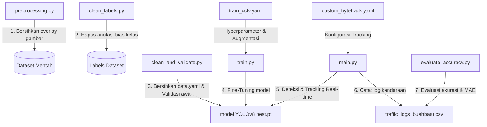

# Panduan & Penjelasan Lengkap: Sistem Vehicle Tracking, Counting, dan Analytics (Jalan Buah Batu, Bandung)

Dokumen ini menjelaskan arsitektur, fungsi, dan cara kerja dari seluruh file kodingan yang ada pada folder proyek **Capstone: Vehicle Tracking, Counting, and Analytics** di Jalan Buah Batu, Bandung. Sistem ini dibangun dengan menggunakan teknologi **Ultralytics YOLOv8**, **ByteTrack**, dan **Roboflow Supervision** dengan standar siap produksi, efisiensi memori yang ketat (*anti-memory leak*), serta mekanisme *fail-safe* tingkat tinggi.

---

## 📂 Struktur Berkas & Hubungan Antar File

Berikut adalah peta berkas kodingan yang ada dalam proyek ini:



---

## 🛠️ Penjelasan Detail Masing-Masing File

### 1. `clean_labels.py`
* **Tujuan Utama**: Membersihkan file anotasi YOLO (`.txt`) dari kelas bias/invalid.
* **Cara Kerja**:
  * Menelusuri seluruh folder label untuk mendeteksi *bounding box* yang memiliki Class ID di luar batas valid (`max_class_id = 4`).
  * Jika ditemukan Class ID yang tidak valid, baris tersebut akan dihapus secara otomatis dari file anotasi tanpa mengganggu baris anotasi lainnya.
* **Mengapa ini penting?** Mencegah model mendeteksi kelas sampah/bias yang bisa mengotori akurasi deteksi kendaraan utama.

---

### 2. `clean_and_validate.py` (Fase 1: Hulu)
* **Tujuan Utama**: Membersihkan konfigurasi dataset (`data.yaml`) dan memperbarui nilai metrik akurasi murni model (`best.pt`) tanpa *retrain*.
* **Fitur Utama**:
  * **Pembersihan `data.yaml`**: Mendeteksi kelas bias bernama `Labelling-data-laku-lintas` dan menghapusnya. Jumlah kelas (`nc`) disesuaikan kembali menjadi 4 kelas valid saja (`Bis`, `Mobil`, `Motor`, `Truk`).
  * **Re-mapping Indeks**: Menggeser indeks kelas pada file anotasi `.txt` setelah kelas bias dihapus (misalnya, jika kelas bias berada di indeks tengah, kelas setelahnya akan digeser mundur agar sinkron dengan `data.yaml` baru).
  * **Validasi Ulang (`model.val()`)**: Menjalankan evaluasi YOLOv8 pada dataset validasi yang sudah bersih untuk mendapatkan nilai mAP@0.5, Precision, dan Recall murni.
* **Parameter CLI**:
  * `--skip-validate`: Hanya melakukan pembersihan tanpa menjalankan validasi model.
  * `--dry-run`: Melihat simulasi pembersihan tanpa mengubah file aslinya (mode aman).

---

### 3. `preprocessing.py` (Fase 1: Pre-processing)
* **Tujuan Utama**: Melakukan pra-pemrosesan pada frame/gambar dataset CCTV untuk meningkatkan konsistensi deteksi.
* **Fitur Utama**:
  * **Masking Teks Overlay (`masking_teks`)**: Kamera CCTV DISHUB Bandung umumnya memiliki overlay teks statis (seperti timestamp, nama simpang, skor fase, dll.). Skrip ini menggunakan metode **Inpainting (TELEA)** di OpenCV untuk menghapus area teks tersebut dan menggantinya dengan tekstur jalanan aspal di sekitarnya. Ini mencegah model mendeteksi bayangan teks sebagai objek.
  * **Optimasi Pagi/Malam (Siap Aktif)**: Memiliki template konfigurasi (CLAHE kontras, Gamma correction, meredam silau lampu malam/glare via `suppress_highlights`, denoising) untuk menyesuaikan kualitas gambar secara dinamis berdasarkan waktu perekaman (pagi/siang/malam).
  * **Struktur OOP (Object-Oriented Programming)**: Mendefinisikan kelas abstrak `BaseCCTVPreprocessor` yang diwarisi oleh kelas spesifik per lokasi (`BubatBarat`, `BubatTimur`, `BubatLingkar`, `BubatSelatan`, `SpBuahBatu`).
  * **Multi-Threading**: Menggunakan `ThreadPoolExecutor` agar proses pembacaan dan pemrosesan ratusan gambar dapat berjalan secara paralel (cepat dan hemat waktu).

---

### 4. `train.py` & `train_cctv.yaml` (Fine-Tuning)
* **Tujuan Utama**: Melatih ulang (fine-tuning) model dasar YOLOv8 menggunakan dataset CCTV Jalan Buah Batu (~1831 gambar pagi + malam).
* **Konfigurasi Spesifik di `train.py`**:
  * Menggunakan GPU NVIDIA RTX 5060 8GB untuk pelatihan.
  * Dikonfigurasi selama **300 Epoch** dengan `batch = 16`, optimizer dengan regularisasi `dropout = 0.1` dan `weight_decay = 0.0005`.
  * Menyimpan checkpoint secara berkala setiap 20 epoch.
* **Augmentasi Spesifik di `train_cctv.yaml` (Disesuaikan untuk Karakteristik CCTV Statis)**:
  * **Augmentasi Geometri Terbatas**: Perspektif (`perspective`), kemiringan (`shear`), dan rotasi (`degrees`) dimatikan (`0.0`) karena sudut kamera CCTV jalan raya selalu statis dan tidak akan pernah berputar.
  * **Flip Vertikal Dimatikan**: `flipud: 0.0` karena kendaraan tidak akan berjalan terbalik. Flip horizontal (`fliplr: 0.3`) diaktifkan untuk mensimulasikan kendaraan dari arah sebaliknya.
  * **Augmentasi Cahaya**: `hsv_v: 0.4` diaktifkan untuk mensimulasikan perubahan kecerahan cuaca (terik vs mendung) dan transisi pagi-malam.
  * **Mosaic & Erasing**: `mosaic: 0.8` (aktif 80%) dan `erasing: 0.3` (random erasing 30%) untuk melatih model agar tetap mengenali kendaraan meskipun terhalang kendaraan lain (oklusi) saat macet. Mosaic otomatis dimatikan pada 20 epoch terakhir (`close_mosaic: 20`) agar model stabil.

---

### 5. `custom_bytetrack.yaml` (Konfigurasi Pelacakan)
* **Tujuan Utama**: Mengatur parameter algoritma tracker **ByteTrack** agar pelacakan ID kendaraan tidak mudah lepas.
* **Parameter Kunci**:
  * `track_high_thresh: 0.25`: Batas kepercayaan minimal untuk pencocokan tahap pertama.
  * `track_low_thresh: 0.1`: **Two-Stage Matching**. Deteksi dengan tingkat keyakinan rendah (0.1 - 0.25) tidak langsung dibuang, melainkan tetap dilacak oleh Kalman Filter. Ini sangat krusial untuk menjaga agar sepeda motor yang berhimpitan tidak kehilangan ID pelacakannya (*occlusion handling*).
  * `track_buffer: 90`: Menyimpan ID kendaraan selama **90 frame (~3 detik)** saat hilang dari pandangan atau berhenti. Hal ini krusial agar Angkot 05 yang mendadak berhenti (ngetem) di pinggir Jalan Buah Batu tidak dianggap sebagai kendaraan baru saat berjalan kembali.

---

### 6. `main.py` (Fase 2: Core Monitoring & Visualisasi)
Ini adalah program utama yang berjalan di tingkat produksi untuk memproses video CCTV secara *real-time*.

* **Komponen Penting di Dalamnya**:
  1. **`VideoSourceManager` (Fail-Safe Mechanism)**:
     * Mencoba membaca Live RTSP Stream URL CCTV ATCS Dishub terlebih dahulu.
     * Jika stream RTSP gagal terhubung atau terputus di tengah jalan, sistem secara otomatis mengalihkan input ke video lokal cadangan (`video_buahbatu.mp4`) secara mulus (*anti-crash*).
     * Terus mencoba menyambung ulang (*reconnect*) ke link RTSP utama setiap 30 detik di latar belakang.
  2. **`TrafficLogger` (Anti-Memory Leak)**:
     * Mencatat setiap event kendaraan yang menyeberang garis ke `traffic_logs_buahbatu.csv` secara instan.
     * Menggunakan modul `csv` bawaan Python dengan mode append (`'a'`). Program sengaja **tidak menggunakan Pandas DataFrame di dalam loop utama** karena Pandas menyimpan data di RAM dan akan mengakibatkan RAM membengkak jika program dijalankan 24 jam non-stop (*memory leak*).
     * Secara berkala membersihkan ID kendaraan yang sudah usang dari memori lokal (`set`).
  3. **`DirectionalCounter` (Virtual Line Crossing & Anti-Double Count)**:
     * Memanfaatkan library `supervision` (`sv.LineZone`) untuk membuat garis virtual horizontal satu arah (menghitung arus dari Selatan ke Utara).
     * Memiliki fitur **Displacement Minimum**: Jika posisi kendaraan bergeser kurang dari `MIN_DISPLACEMENT_PX (5 piksel)`, statusnya akan dikunci. Hal ini mencegah *double-counting* (kendaraan terhitung berulang kali) saat terjadi kemacetan parah di atas garis virtual.
  4. **`VisualHUD` (Premium User Interface)**:
     * Menampilkan Head-Up Display (HUD) premium di layar.
     * Pojok Kiri Atas: Panel semi-transparan yang menampilkan akumulasi jumlah kendaraan per kelas (`Bis`, `Mobil`, `Motor`, `Truk`) lengkap dengan warna indikator yang estetik.
     * Pojok Kanan Atas: Panel status yang menunjukkan FPS *real-time*, nomor frame, dan label sumber video yang aktif (`RTSP LIVE` atau `LOCAL`).
     * Efek Garis Dinamis: Garis virtual default berwarna **Hijau**, namun akan berkedip **Merah** selama 2 frame saat ada kendaraan yang melintasi garis tersebut secara sah.
     * Bounding box bersih dilengkapi dengan garis ekor pergerakan (`sv.TraceAnnotator`).

---

### 7. `evaluate_accuracy.py` (Fase 3: Validasi Lapangan)
* **Tujuan Utama**: Menguji keandalan sistem dengan membandingkan hitungan otomatis sistem vs hitungan manual manusia (*Ground Truth*).
* **Fitur Utama**:
  * **Agregasi Waktu (5 Menit)**: Mengelompokkan data dari `traffic_logs_buahbatu.csv` ke dalam interval 5 menit (total 12 blok data dalam 1 jam pengujian).
  * **Kalkulasi MAE (Mean Absolute Error)**:
    $$\text{MAE} = \frac{1}{n} \sum_{i=1}^{n} |y_i - \hat{y}_i|$$
    Menghitung rata-rata selisih mutlak antara hitungan manual ($y_i$) dengan hitungan sistem ($\hat{y}_i$).
  * **Akurasi per Kelas**: Menghitung persentase akurasi akhir per kelas kendaraan serta akurasi keseluruhan sistem.
  * **Analisis & Interpretasi**: Memberikan kesimpulan otomatis apakah performa pelacakan sistem masuk kategori Sangat Baik ($\ge 90\%$), Cukup Baik ($\ge 80\%$), Perlu Peningkatan ($\ge 70\%$), atau Perlu Evaluasi Mendalam ($< 70\%$).

---

## 🚀 Alur Kerja Cara Menjalankan Sistem

Berikut adalah urutan langkah eksekusi program di terminal/command prompt:

### Langkah 1: Pra-Pemrosesan Gambar Dataset (Opsional)
Untuk membersihkan data overlay teks CCTV pada dataset:
```bash
python preprocessing.py --lokasi bubat_barat --waktu pagi
```

### Langkah 2: Membersihkan Konfigurasi Kelas Dataset (Fase 1)
Lakukan pembersihan kelas bias pada `data.yaml` dan sinkronisasi file label:
```bash
python clean_and_validate.py
```
*(Tambahkan argumen `--dry-run` jika ingin meninjau perubahan terlebih dahulu tanpa mengubah file)*

### Langkah 3: Melatih Ulang Model YOLOv8 (Opsional)
Jika ingin melakukan fine-tuning kembali dengan hyperparameter baru:
```bash
python train.py
```

### Langkah 4: Menjalankan Aplikasi Monitoring Utama (Fase 2)
Jalankan sistem deteksi, pelacakan, dan penghitungan real-time:
* **Menjalankan dengan video lokal (cadangan)**:
  ```bash
  python main.py --source video_buahbatu.mp4 --show
  ```
* **Menjalankan dengan Live Stream RTSP CCTV**:
  ```bash
  python main.py --source rtsp://username:password@ip_cctv:port/stream --show
  ```
* **Menyimpan hasil visualisasi video ke file**:
  ```bash
  python main.py --source video_buahbatu.mp4 --save-video
  ```
*(Tekan tombol `'q'` atau `'ESC'` di keyboard untuk menghentikan program dengan aman dan menutup file log)*

### Langkah 5: Evaluasi Hasil Akurasi (Fase 3)
Buka file `evaluate_accuracy.py` dan masukkan data hitungan manual Anda pada dictionary `GROUND_TRUTH`. Kemudian jalankan evaluasi:
```bash
python evaluate_accuracy.py --csv traffic_logs_buahbatu.csv --export
```
Skrip ini akan memproses data dan menghasilkan laporan evaluasi di terminal serta mengekspor file laporan baru bernama `evaluation_report.csv`.

---

## 💡 Fitur Kunci untuk Keandalan Siap Produksi

1. **Anti-Memory Leak**: Penggunaan operasi penulisan file CSV secara *append* langsung dan pembersihan ID pelacakan berkala (`cleanup_stale_ids`) menjamin RAM PC/Server tidak akan membengkak, sangat aman untuk penggunaan pemantauan 24/7.
2. **Dynamic Visual Feedback**: Visualisasi HUD yang premium, ekor pergerakan (*trace*), dan garis virtual yang berubah warna dinamis memberikan efek presentasi/demo yang sangat memukau bagi publik/pengguna.
3. **Kalman Filter Tuning**: Modifikasi parameter ByteTrack (`low_thresh=0.1`, `buffer=90`) secara signifikan mengurangi kegagalan tracking ID (seperti ID melompat/berganti) pada kondisi lalu lintas padat khas Indonesia yang sarat dengan sepeda motor dan angkutan umum yang sering berhenti mendadak.
